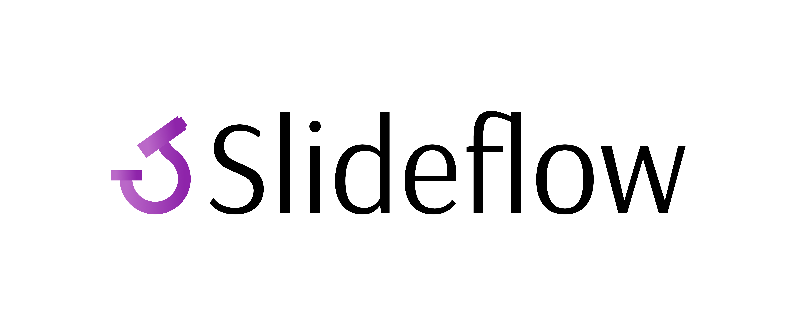

[](https://github.com/pearson-laboratory/slideflow/actions/workflows/python-app.yml)

# Slideflow

Slideflow is a computational pathology Python package which aims to provide an easy and intuitive way of building and testing deep learning models for use in histology image analysis. It is built using Keras (with Tensorflow backend) and supports all Keras architectures, as well as [CLAM](https://github.com/mahmoodlab/CLAM). The overarching goal of the package is to provide tools to train and test models on histology slides, apply these models to new slides, and assess performance using analytical tools including predictive heatmaps, mosaic maps, ROCs, and more.

Slideflow requires Python 3.7+ and [libvips](https://libvips.github.io/libvips/).

To get started, ensure you have the latest version of pip, setuptools, and wheel installed:

```
pip3 install --upgrade setuptools pip wheel
```

Install package requirements from source/requirements.txt:

```
pip3 install -r requirements.txt
```

Import the module in python and initialize a new project:

```python
import slideflow as sf
SFP = sf.Project.from_prompt("/path/to/project/directory")
```

You will be taken through a set of questions to configure your new project. Slideflow projects require an annotations file (CSV) associating patient names to outcome categories and slide names. If desired, a blank file will be created for you when you first setup a new project. Once the project is created, add rows to the annotations file with patient names and outcome categories.

Next, you will be taken through a set of questions to configure your first dataset. Alternatively, you may manually add a dataset by calling:

```python
SFP.add_dataset( name="NAME",
                 slides="/slides/directory",
                 roi="/roi/directory",
                 tiles="/tiles/directory",
                 tfrecords="/tfrecords/directory" )
```

Once your annotations file has been set up and you have a dataset to work with, begin extracting tiles at specified pixel and micron size:

```python
SFP.extract_tiles(tile_px=299, tile_um=302)
```

Following tile extraction, you can begin model training:

```python
SFP.train()
```

Please see the documentation at [slideflow.dev](https://www.slideflow.dev/).
