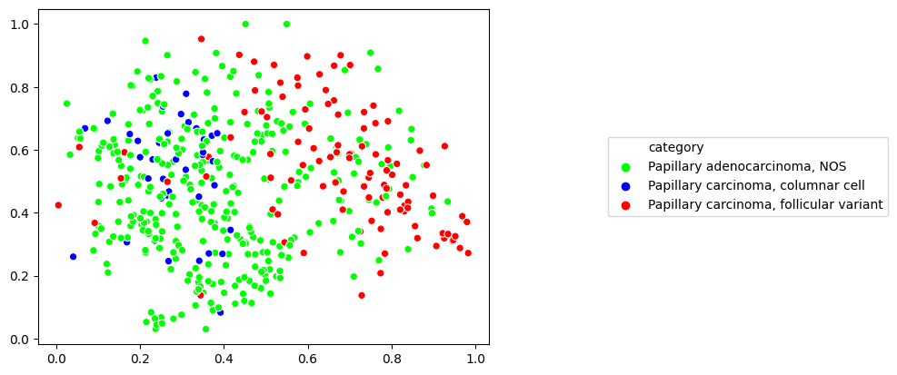

Layer activations
=================

Once a model has been fully trained and evaluated, you may use the model to generate layer activations to gain better insight into the kinds of image features the model has learned.

Mosaic maps
***********

The easiest way to get started with layer activations is to calculate and display layer activations as a mosaic map. Mosaic maps are generated by calculating layer activations for a set of tiles (via :class:`slideflow.activations.ActivationsVisualizer`), performing dimensionality reduction (UMAP) on the activations (via :class:`slideflow.statistics.SlideMap`), and overlaying tile images onto the UMAP (via :class:`slideflow.mosaic.Mosaic`). By default, the post-convolutional ('postconv') layer is used when calculating activations, but any combination of other layers can be also be used. The ``Project`` class has a function which can supervise these steps automatically and save the final figure to the project directory:

.. code-block:: python

    SFP.generate_mosaic(
        model="/path/to/saved/model.h5",
        mosaic_filename="/path/to/destination/mosaic.png",
        filters={"dataset": ["evaluation"]})

.. autofunction:: slideflow.project.Project.generate_mosaic
   :noindex:

.. image:: mosaic_example2.jpg

If you provide a filename to the ``umap_filename`` argument, a plot of the constituent tiles will also be saved. If you additionally provide an outcome header (as saved in the annotations file) to the argument ``outcome_label_headers``, these tiles will be colored according to the slide-level annotation in the provided outcome header column of the annotations file:

.. image:: umap_example.png

Instead of mapping all tiles within a slide, you can choose instead to map only centroid tiles by passing ``map_slide='centroid'``:

There are many additional arguments that can be provided to the :meth:`slideflow.Project.generate_mosaic()` function to customize the mosaic and UMAP plots. However, you may choose to further customize these plots by working with the :class:`slideflow.mosaic.Mosaic` object directly, which are returned from the ``generate_mosaic()`` function.

For example, it may be interesting to view a UMAP of tiles with an added third dimension, such as the activation value of a particular penultimate layer node. With this kind of plot, one can visualize how the activation of a particular node varies across the UMAP. To make such a plot, use the ``save_3d_node_plot`` function of the ``SlideMap``:

.. code-block:: python

    mosaic = SFP.generate_mosaic(
        model="/path/to/saved/model.h5",
        mosaic_filename="/path/to/destination/mosaic.png",
        filters={"dataset": ["evaluation"]})

    slide_map = mosiac.slide_map
    slide_map.save_3d_node_plot(node=497)

.. image:: 3d_umap.png

Working with Activations
************************

To work more directly with layer activations, use either :class:`slideflow.activations.ActivationsInterface` to generate activations on a tile or slide level, or :class:`slideflow.activations.ActivationsVisualizer` to generate activations for an entire dataset.

ActivationsInterace
-------------------

The :class:`slideflow.activations.ActivationsInterface` class can be used to generate activations for a single batch of images. For example, to generate activations for a batch of images while looping through a dataset:

.. code-block:: python

    interface = sf.activations.ActivationsInterface(layer='postconv')
    for image_batch in dataset:
        postconv_activations = interface(image_batch)

You can choose to return activations for any combination of intermediate layers by passing layer name(s) to the argument ``layer``. The interface can also return logits, by passing ``include_logits=True``.

To generate activations across an entire slide, the same interface can be called on a :class:`slideflow.slide.WSI` object, generating a grid of activations of size ``(slide.grid.shape[0], slide.grid.shape[1], num_features)``:

.. code-block:: python

    slide = sf.slide.WSI(...)
    interface = ActivationsInterface('/model/path', layers='postconv')
    activations_grid = interface(slide)

ActivationsVisualizer
---------------------

The :class:`slideflow.activations.ActivationsVisualizer` class is used to calculate and examine activations across an entire dataset. Instancing the class supervises the calculation and caching of layer activations, which can then be exported, viewed (as a mosaic map), or analyzed with various statistical methods. The project function :func:`slideflow.project.Project.generate_activations` creates and returns an instance of this class.

.. code-block:: python

    AV = SFP.generate_activations(
        model='/path/to/trained_model',
        outcome_label_headers='HPV')

Alternatively, you can create an instance of this class directly:

.. code-block:: python

    dataset = SFP.dataset(299, 302)

    AV = sf.activations.ActivationsVisualizer(
        model='/path/to/trained_model',
        tfrecords=dataset.tfrecords(),
        annotations=dataset.slide_to_label('HPV')
    )

To return the average logits value for each slide (averaged across constituent tiles), use :func:`slideflow.activations.ActivationsVisualizer.logits_mean`. Similarly, :func:`slideflow.activations.ActivationsVisualizer.logits_predict` can be used to generate final slide-level logit predictions.

Activations of individual features across categories can be statistically compared using :func:`slideflow.activations.ActivationsVisualizer.feature_stats`, which will calculate and save statistics to a specified directory.

.. code-block:: python

    AV.feature_stats(outdir='/path', method='mean')

To compare activations of layer nodes across outcome categories and find nodes which differ significantly across categories, use the :func:`slideflow.activations.ActivationsVisualizer.box_plots` function:

.. image:: boxplot_example.png

Many other functions are available, as described in the documentation, :class:`slideflow.activations.ActivationsVisualizer`.