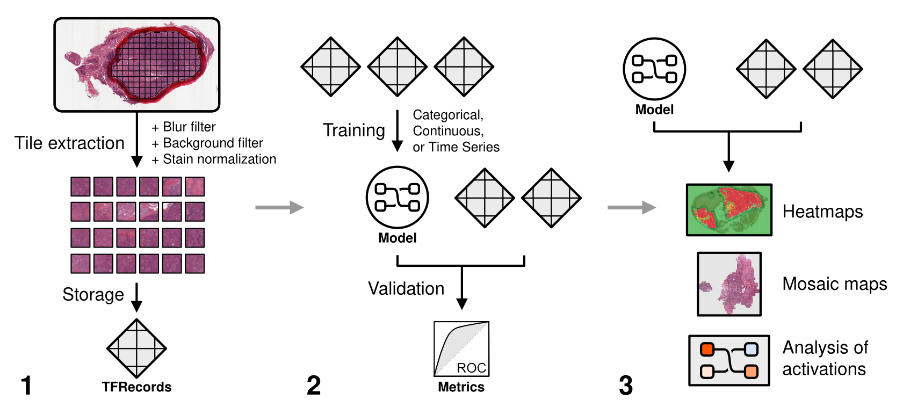

Pipeline Overview
=================

    *High-level overview of main functions.*

The overall pipeline for a deep learning experiment is separated into three phases.

1) **Tile extraction** - annotate slides with regions of interest (ROIs) [*optional*] and extract image tiles from whole-slide images.

2) **Model training** - perform a hyperparameter sweep [*optional*], train a model, and evaluate the model on a held-out test set.

3) **Explainability** - generate predictive heatmaps and analyze learned image features.

|

A high-level overview of each of these phases is provided below. We will examine each step in more detail in the following sections.

Step 1: ROI Annotation
**********************

1) **Label ROIs** (optional). Using `QuPath <https://qupath.github.io/>`_, annotate whole-slide images with the Polygon tool. Then, click **Automate** -> **Show script editor**. In the box that comes up, click **File** -> **Open** and load the ``qupath_roi.groovy`` script (QuPath 0.2 or greater) or ``qupath_roi_legacy.groovy`` (QuPath 0.1.x). Click **Run** -> **Run** if using QuPath 0.2 or greater, or **Run** -> **Run for Project** if using QuPath 0.1.x. ROIs will be exported in CSV format in the QuPath project directory, in the subdirectory "ROI".

.. note::
    This step may be skipped if you are performing analysis on whole-slide images, rather than annotated tumor regions.

Step 2: Dataset preparation
***************************

2) **Extract tiles**. Once ROIs have been created, tiles will need to be extracted from the ROIs across all of your slides. Tiles will be extracted at a given magnification size in microns, and saved at a given resolution in pixels. The optimal extraction size in both microns and pixels will depend on your dataset and model architecture. Poor quality tiles - including background tiles or tiles with high whitespace content - will be automatically discarded. Tiles will be stored as TFRecords, a binary file format used to improve dataset reading performance during training. Each slide will have its own TFRecord file containing its extracted tiles.

3) **Set aside final evaluation set**. Using the project annotations CSV file, designate which slides should be saved for final evaluation.

4) **Establish training and validation dataset**. By default, three-fold cross-validation will be performed during training. Many other validation strategies are also supported (:ref:`validation_planning`).

Step 3: Model training
**********************

5) **Choose hyperparameters**. Before training can begin, you must choose both a model architecture (e.g. InceptionV3, VGG16, ResNet, etc.) and a set of hyperparameters (e.g. batch size, learning rate, etc.). This can be done explicitly one at a time, or an automatic hyperparameter sweep (grid search via :meth:`slideflow.Project.create_hp_sweep` or Bayesian search via :meth:`slideflow.Project.smac_search`) can be configured.

6) **Initiate training**. Train your model across all desired hyperparameters and select the best-performing hyperparameter combination for final evaluation testing.

Step 4: Model evaluation
************************
Validation testing is performed both during training - at specified epochs - and after training has completed. Various metrics are recorded in the project directory at these intervals to assist with model performance assessment, including:

- **Training and validation loss**
- **Training and validation accuracy** (for categorical outcomes)
- **Tile-level, slide-level, and patient-level AUROC and AP** (for categorical outcomes)
- **Tile-level, slide-level, and patient-level scatter plots with R-squared** (for continuous outcomes)
- **Tile-level, slide-level, and patient-level C-index** (for Cox Proportional Hazards models)
- **Histograms of predictions** (for continuous outcomes)

Step 5: Heatmaps
****************
In addition to the above metrics, performance of a trained model can be assessed by visualizing predictions for a set slides as heatmaps.

.. image:: heatmap_example.png

Step 6: Mosaic maps
*******************
Learned image features can be visualized using dimensionality reduction on model layer activations. A set of image tiles is first provided to your trained model, which calculates activations at a specified intermediate layer. Tile-level activations are then plotted with dimensionality reduction (UMAP), and points on the plot are replaced with image tiles, generating a mosaic map.

.. image:: mosaic_example.png

Step 7: Interactive visualization
*********************************
Finally, use a trained model to visualize predictions for whole-slide images with the interactive tool Slideflow Workbench. This powerful whole-slide image viewer includes deep learning tools enabling you to visualize model predictions on whole-slide images, standard JPG/PNG files, real-time camera feeds, and even Generative Adversarial Network (GAN) -generated images.

.. image:: workbench_preview.png
