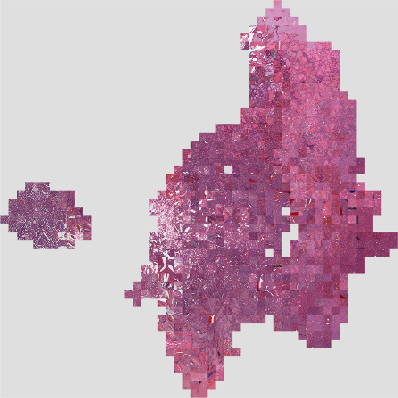

.. currentmodule:: slideflow.model

.. _activations:

Layer Activations
=================

Investigating the latent space of a neural network can provide useful insights into the structure of your data and what models have learned during training. Slideflow provides several tools for post-hoc latent space analysis of trained neural networks, primarily by calculating activations at one or more neural network layers for all images in a dataset. In the next sections, we will take a look at how these layer activations can be calculated for downstream analysis and provide examples of analyses that can be performed.

Calculating Layer Activations
*****************************

Activations at one or more layers of a trained network can be calculated with :class:`slideflow.model.Features` and :class:`slideflow.DatasetFeatures`. The former provides an interface for calculating layer activations for a batch of images, and the latter supervises calculations across an entire dataset.

Batch of images
---------------

:class:`Features` provides an interface for calculating layer activations and predictions on a batch of images. The following arguments are available:

- ``path``: Path to model, from which layer activations are calculated. Required.
- ``layers``: Layer(s) at which to calculate activations.
- ``include_preds``: Also return the final network output (predictions)
- ``pooling``: Apply pooling to layer activations, to reduce dimensionality to one dimension.

If ``layers`` is not supplied, activations at the post-convolutional layer will be calculated by default.

Once initialized, the resulting object can be called on a batch of images and will return the layer activations for all images in the batch. For example, to calculate activations at the ``sep_conv_3`` layer of a model while looping through a dataset:

.. code-block:: python

    import slideflow as sf

    sepconv3 = sf.model.Features('model/path', layer='sep_conv_3')
    for img_batch in dataset:
        postconv_activations = sepconv3(img_batch)

If ``layer`` is a list of layer names, activations at each layer will be calculated and concatenated. If ``include_preds`` is ``True``, the interface will also return the final predictions:

.. code-block:: python

    sepconv3_and_preds = sf.model.Features(..., include_preds=True)
    layer_activations, preds = sepconv3_and_preds(img_batch)

.. note::

    :class:`Features` assumes that image batches already have any necessary preprocessing already applied, including standardization and stain normalization.

See the API documentation for :class:`Features` for more information.

Single slide
------------

Layer activations can also be calculated across an entire slide using the same :class:`Features` interface. Calling the object on a :class:`slideflow.WSI` object will generate a grid of activations of size ``(slide.grid.shape[0], slide.grid.shape[1], num_features)``:

.. code-block:: python

    import slideflow as sf

    slide = sf.WSI(...)
    postconv = sf.model.Features('/model/path', layers='postconv')
    feature_grid = postconv(slide)
    print(feature_grid.shape)

.. rst-class:: sphx-glr-script-out

    .. code-block:: none

        (50, 45, 2048)

.. _dataset_features:

Entire dataset
--------------

Finally, layer activations can also be calculated for an entire dataset using :class:`slideflow.DatasetFeatures`. Instancing the class supervises the calculation and caching of layer activations, which can then be used for downstream analysis. The project function :func:`slideflow.Project.generate_features` creates and returns an instance of this class.

.. code-block:: python

    dts_ftrs = P.generate_features('/path/to/trained_model')

Alternatively, you can create an instance of this class directly:

.. code-block:: python

    import slideflow as sf

    dataset = P.dataset(tile_px=299, tile_um=302)
    dts_ftrs = sf.DatasetFeatures(
      model='/path/to/trained_model',
      dataset=dataset,
    )

Tile-level feature activations for each slide can be accessed directly from ``DatasetFeatures.activations``, a dict mapping slide names to numpy arrays of shape ``(num_tiles, num_features)``. Predictions are stored in ``DatasetFeatures.predictions``, a dict mapping slide names to numpy arrays of shape ``(num_tiles, num_classes)``. Tile-level location data (coordinates from which the tiles were taken from their respective source slides) is stored in ``DatasetFeatures.locations``, a dict mapping slide names to numpy arrays of shape ``(num_tiles, 2)`` (``x``, ``y``).

Activations can be exported to a Pandas DataFrame with :meth:`slideflow.DatasetFeatures.to_df` or exported into PyTorch format with :meth:`slideflow.DatasetFeatures.to_torch`. See :ref:`features` for more information about generating and exporting features for MIL models.

Read the API documentation for :class:`slideflow.DatasetFeatures` for more information.

.. _slidemap:

Mapping Activations
*******************

Layer activations across a dataset can be dimensionality reduced with UMAP and plotted for visualization using :meth:`slideflow.DatasetFeatures.map_activations`. This function returns an instance of :class:`slideflow.SlideMap`, a class that provides easy access to labeling and plotting.

The below example calculates layer activations at the neural network layer ``sep_conv_3`` for an entire dataset, and then reduces the activations into two dimensions for easy visualization using UMAP. Any valid `UMAP parameters <https://umap-learn.readthedocs.io/en/latest/parameters.html>`_ can be passed via keyword argument.

.. code-block:: python

    dts_ftrs = P.generate_features(
      model='/path/to/trained_model',
      layers='sep_conv_3'
    )
    slide_map = dts_ftrs.map_activations(
        n_neighbors=10, # UMAP parameter
        min_dist=0.2    # UMAP parameter
    )

We can then plot the activations with :meth:`slideflow.SlideMap.plot`. All keyword arguments are passed to the `matplotlib scatter <https://matplotlib.org/stable/api/_as_gen/matplotlib.pyplot.scatter.html>`_ function.

.. code-block:: python

    import matplotlib.pyplot as plt

    slide_map.plot(s=10)
    plt.show()

We can add labels to our plot by first passing a dictionary with slide labels to the function :meth:`slideflow.SlideMap.label_by_slide`.

.. code-block:: python

    # Get a dictionary mapping slide names to category labels
    dataset = P.dataset(tile_px=299, tile_um='10x')
    labels, unique_labels = dataset.labels('subtype', format='name')

    # Assign the labels to the slide map, then plot
    slide_map.label_by_slide(labels)
    slide_map.plot()

.. image:: umap_example.png

|

Finally, we can use :meth:`SlideMap.umap_transform` to project new data into two dimensions using the previously fit UMAP.

.. code-block:: python

    import slideflow as sf
    import numpy as np

    # Create a SlideMap using layer activations reduced with UMAP
    dts_ftrs = P.generate_features(
      model='/path/to/trained_model',
      layers='sep_conv_3'
    )
    slide_map = dts_ftrs.map_activations()

    # Load some dummy data.
    # Second dimension must match size of activation vector.
    dummy = np.random.random((100, 1024))

    # Transform the data using the already-fit UMAP.
    transformed = slide_map.umap_transform(dummy)
    print(transformed.shape)

.. rst-class:: sphx-glr-script-out

    .. code-block:: none

        (100, 2)

Read more about additional :class:`slideflow.SlideMap` functions, including saving, loading, and clustering, in the linked API documentation.

.. _mosaic_map:

Mosaic Maps
***********

Mosaic maps provide a tool for visualizing the distribution of histologic image features in a dataset through analysis of neural network layer activations. Similar to `activation atlases <https://distill.pub/2019/activation-atlas/>`_, a mosaic map is generated by first calculating layer activations for a dataset, dimensionality reducing these activations with `UMAP <https://joss.theoj.org/papers/10.21105/joss.00861>`_,  and then overlaying corresponding images in a grid-wise fashion.

|

In the previous sections, we reviewed how to calculate layer activations across a dataset, and then dimensionality reduce these activations into two dimensions using UMAP. :class:`slideflow.Mosaic` provides a tool for converting these activation maps into a grid of image tiles plotted according to their associated activation vectors.

Quickstart
----------

The fastest way to build a mosaic map is using :class:`slideflow.Project.generate_mosaic`, which requires a ``DatasetFeatures`` object as its only mandatory argument and returns an instance of :class:`slideflow.Mosaic`.

.. code-block:: python

    dts_ftrs = P.generate_features('/path/to/trained_model', layers='postconv')
    mosaic = P.generate_mosaic(dts_ftrs)
    mosaic.save('mosaic.png')

When created with this interface, the underlying :class:`slideflow.SlideMap` object used to create the mosaic map is accessible via ``slideflow.Mosaic.slide_map``. You could, for example, use :func:`slideflow.SlideMap.save` to save the UMAP plot:

.. code-block:: python

    mosiac.slide_map.save('umap.png')

From a SlideMap
---------------

Any ``SlideMap`` can be converted to a mosaic map with :meth:`slideflow.SlideMap.generate_mosaic()`.

.. code-block:: python

    ftrs = P.generate_features('/path/to/model')
    slide_map = ftrs.map_activations()
    mosaic = slide_map.generate_mosaic()
    mosaic.save('mosaic.png')

Manual creation
---------------

Mosaic maps can be flexibly created with :class:`slideflow.Mosaic`, requiring two components: a set of images and corresponding coordinates. Images and coordinates can either be manually provided, or the mosaic can dynamically read images from TFRecords (as is done with :meth:`Project.generate_mosaic()`).

The first argument of :class:`slideflow.Mosaic` provides the images, and may be either of the following:

- A list or array of images (np.ndarray, HxWxC)
- A list of tuples, containing ``(slide_name, tfrecord_index)``

The second argument provides the coordinates:

- A list or array of (x, y) coordinates for each image

For example, to create a mosaic map from a list of images and coordinates:

.. code-block:: python

    # Example data (images are HxWxC, np.ndarray)
    images = [np.ndarray(...), ...]
    coords = [(0.2, 0.9), ...]

    # Generate the mosaic
    mosaic = Mosaic(images, coordinates)
    mosaic.plot()

You can also generate a mosaic map where the images are tuples of `(tfrecord, tfrecord_index)`. In this case, the mosaic map will dynamically read images from TFRecords during plotting.

.. code-block:: python

    # Example data
    tfrecords = ['/path/to/tfrecord`.tfrecords', ...]
    idx = [253, 112, ...]
    coords = [(0.2, 0.9), ...]

    # Generate mosaic map
    mosaic = sf.Mosaic(
        images=[(tfr, idx) for tfr, idx in zip(tfrecords, idx)],
        coords=coords
    )

There are several additional arguments that can be used to customize the mosaic map plotting. Read the linked API documentation for :class:`slideflow.Mosaic` for more information.