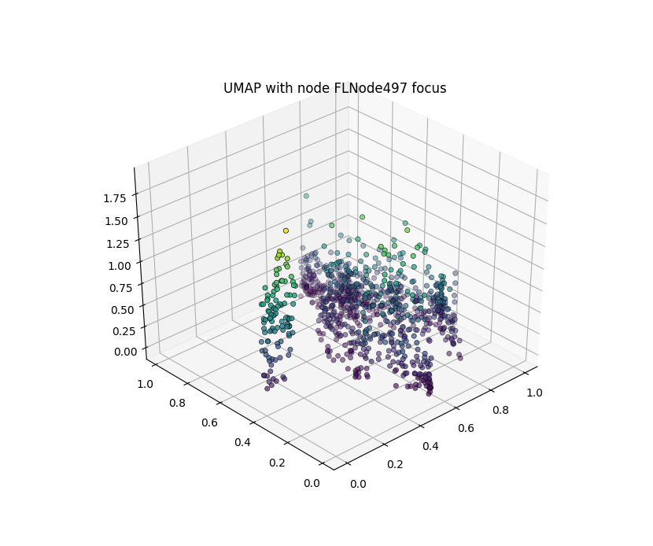

.. currentmodule:: slideflow.model

Post-hoc Analysis
=================

Investigating the latent space of a neural network can provide useful insights into the structure of your data and what models have learned during training. Slideflow provides several tools for post-hoc latent space analysis of trained neural networks, primarily by calculating activations at one or more neural network layers for all images in a dataset. In the next sections, we will take a look at how these layer activations can be calculated for downstream analysis and provide examples of analyses that can be performed.

Layer activations
*****************

Activations at one or more layers of a trained network can be calculated with :class:`slideflow.model.Features` and :class:`slideflow.DatasetFeatures`. The former provides an interface for calculating layer activations for a batch of images, and the latter supervises calculations across an entire dataset.

Batch of images
---------------

:class:`Features` provides an interface for calculating layer activations and logits on a batch of images. The following arguments are available:

- ``path``: Path to model, from which layer activations are calculated. Required.
- ``layers``: Layer(s) at which to calculate activations.
- ``include_logits``: Also return the final network output (logits)
- ``pooling``: Apply pooling to layer activations, to reduce dimensionality to one dimension.

If ``layers`` is not supplied, activations at the post-convolutional layer will be calculated by default.

Once initialized, the resulting object can be called on a batch of images and will return the layer activations for all images in the batch. For example, to calculate activations at the ``sep_conv_3`` layer of a model while looping through a dataset:

.. code-block:: python

    import slideflow as sf

    sepconv3 = sf.model.Features('model/path', layer='sep_conv_3')
    for img_batch in dataset:
        postconv_activations = sepconv3(img_batch)

If ``layer`` is a list of layer names, activations at each layer will be calculated and concatenated. If ``include_logits`` is ``True``, the interface will also return the final logits:

.. code-block:: python

    sepconv3_and_logits = sf.model.Features(..., include_logits=True)
    layer_activations, logits = sepconv3_and_logits(img_batch)

.. note::

    :class:`Features` assumes that image batches already have any necessary preprocessing already applied, including standardization and stain normalization.

See the API documentation for :class:`Features` for more information.

Single slide
------------

Layer activations can also be calculated across an entire slide using the same :class:`Features` interface. Calling the object on a :class:`slideflow.WSI` object will generate a grid of activations of size ``(slide.grid.shape[0], slide.grid.shape[1], num_features)``:

.. code-block:: python

    import slideflow as sf

    slide = sf.WSI(...)
    postconv = sf.model.Features('/model/path', layers='postconv')
    feature_grid = postconv(slide)
    print(feature_grid.shape)

.. rst-class:: sphx-glr-script-out

    .. code-block:: none

        (50, 45, 2048)

Entire dataset
--------------

Finally, layer activations can also be calculated for an entire dataset using :class:`DatasetFeatures`. Instancing the class supervises the calculation and caching of layer activations, which can then be used for downstream analysis. The project function :func:`slideflow.Project.generate_features` creates and returns an instance of this class.

.. code-block:: python

    dts_ftrs = P.generate_features('/path/to/trained_model')

Alternatively, you can create an instance of this class directly:

.. code-block:: python

    import slideflow as sf

    dataset = P.dataset(tile_px=299, tile_um=302)
    dts_ftrs = sf.DatasetFeatures(
      model='/path/to/trained_model',
      dataset=dataset,
    )

Tile-level feature activations for each slide can be accessed directly from ``DatasetFeatures.activations``, a dict mapping slide names to numpy arrays of shape ``(num_tiles, num_features)``. Logits are stored in ``DatasetFeatures.logits``, a dict mapping slide names to numpy arrays of shape ``(num_tiles, num_logits)``. Tile-level location data (coordinates from which the tiles were taken from their respective source slides) is stored in ``DatasetFeatures.locations``, a dict mapping slide names to numpy arrays of shape ``(num_tiles, 2)`` (``x``, ``y``).

Activations can be exported to a Pandas DataFrame with :meth:`DatasetFeatures.to_df` or exported into PyTorch format (for use with :ref:`multi-instance learning (MIL) <clam>` models) with :meth:`DatasetFeatures.to_torch`

Read the API documentation for :class:`DatasetFeatures` for more information.

Slide maps
***********

TODO

Mosaic maps
***********

Mosaic maps provide a tool for visualizing the distribution of histologic image features in a dataset through analysis of neural network layer activations. Similar to `activation atlases <https://distill.pub/2019/activation-atlas/>`_, a mosaic map is generated by first calculating layer activations for a dataset, dimensionality reducing these activations with `UMAP <https://joss.theoj.org/papers/10.21105/joss.00861>`_,  and then overlaying corresponding images in a grid-wise fashion.

.. image:: mosaic_example.png

|

To visualize the distribution of features across a dataset, a mosaic map can be created from a :class:`DatasetFeatures` instance. Mosaic maps are generated by using features (layer activations) from a dataset, performing dimensionality reduction (UMAP) on the activations (via :class:`slideflow.SlideMap`), and overlaying tile images onto the UMAP (via :class:`slideflow.Mosaic`). By default, the post-convolutional ('postconv') layer is used when calculating features, but any combination of other layers can be also be used. The ``Project`` class has a function which can supervise these steps automatically and save the final figure to the project directory.

.. code-block:: python

    dts_ftrs = P.generate_features('/path/to/trained_model')
    mosaic = P.generate_mosaic(dts_ftrs)
    mosaic.save('mosaic.png')

To plot the underlying UMAP without overlaid images, the :class:`slideflow.SlideMap` used to create the mosaic map can be accesssed via ``slideflow.Mosaic.slide_map``. You can then use the :func:`slideflow.SlideMap.save` function to save the plot:

.. code-block:: python

    mosaic = project.generate_mosaic(...)
    mosiac.slide_map.save('umap.png')

Tiles on the plot can be labeled using slide labels from the project annotations file, using the function :func:`slideflow.SlideMap.label_by_slide`. For example, the following will label the slide map according to the categorical outcome "HPV_status" in the project annotations file:

.. code-block:: python

    # Get slide labels
    dataset = project.dataset(tile_px=299, tile_um=302)
    labels, unique_lables = dataset.labels('HPV_status')

    # Create the mosaic map and access the underlying SlideMap
    mosaic = project.generate_mosaic(...)

    # Label the slide map with our outcome
    mosiac.slide_map.label_by_slide(labels)

    # Save
    mosiac.slide_map.save('umap_labeled.png')

By default, all tiles in a dataset (which may be hundreds of thousands or millions of images) will be mapped onto the mosaic map. Instead of mapping all tiles within a slide, you can alternatively choose to map only a single tile per slide with the argument ``map_slide='centroid'``. This will calculate the tile nearest to centroid for each slide and display only this tile:

.. code-block:: python

    # Create the mosaic map and access the underlying SlideMap
    mosaic = project.generate_mosaic(..., map_slide='centroid')

There are many additional arguments that can be provided to the :meth:`slideflow.Project.generate_mosaic()` function to customize the mosaic and UMAP plots, and many additional functions that can be applied to :class:`slideflow.Mosaic` and :class:`slideflow.SlideMap`. For example, it may be interesting to view a UMAP of tiles with an added third dimension, such as the activation value of a particular penultimate layer node. With this kind of plot, one can visualize how the activation of a particular node varies across the UMAP. To make such a plot, use the ``save_3d_plot`` function of the ``SlideMap``:

.. code-block:: python

    mosaic = project.generate_mosaic(...)
    mosiac.slide_map.save_3d_plot('3d_plot.png', feature=497)

