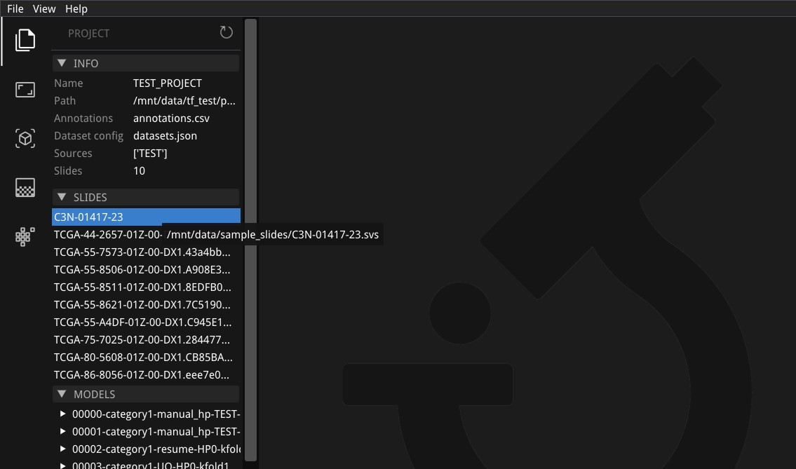
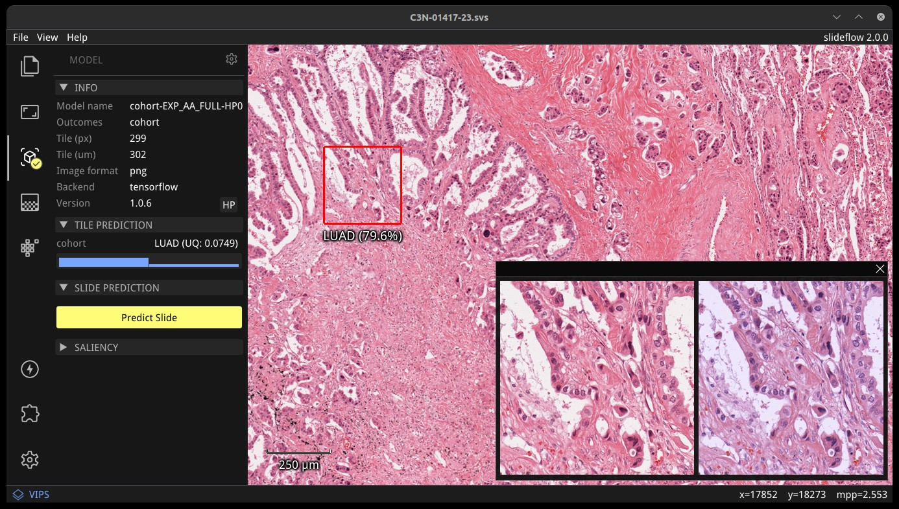
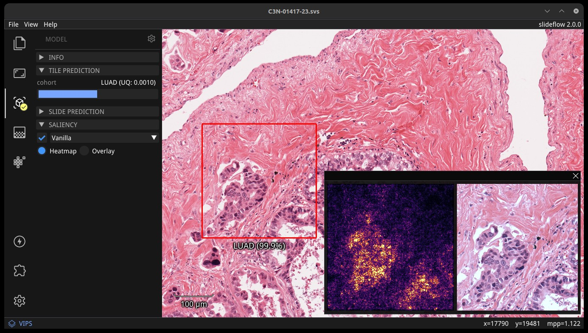
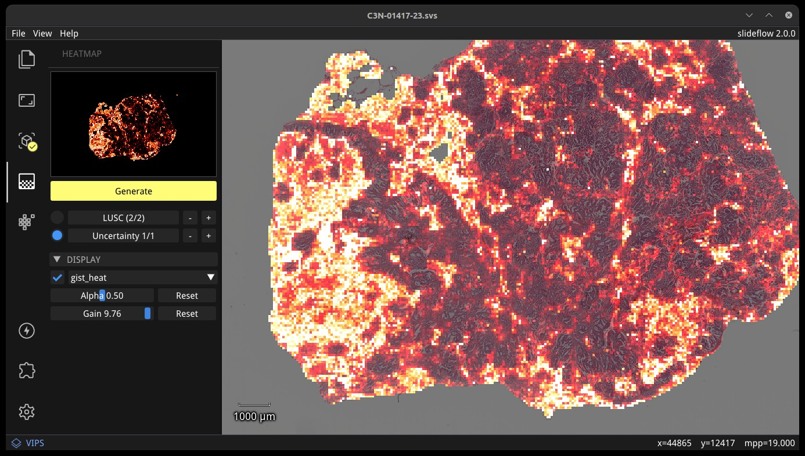
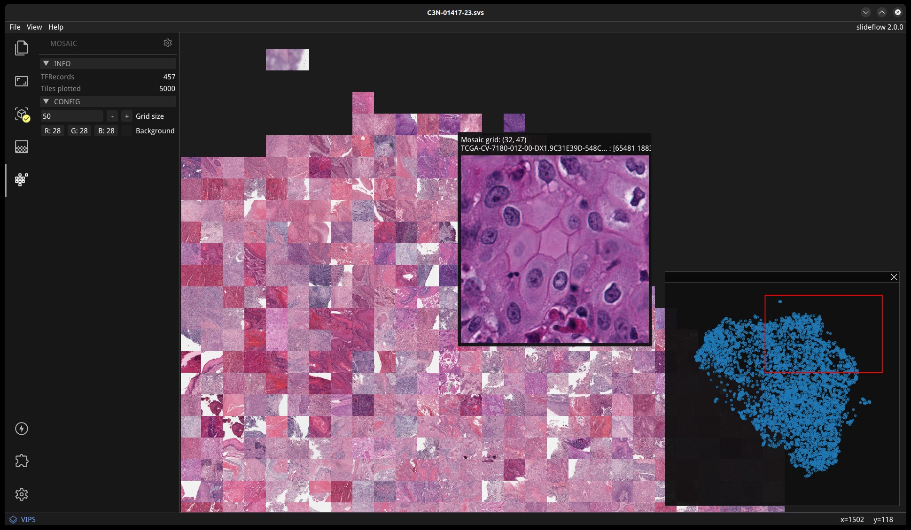

.. _studio:

Slideflow Studio: Live Visualization
====================================

.. video:: https://media.githubusercontent.com/media/jamesdolezal/slideflow/master/docs/studio_preview.webm
    :width: 100%
    :autoplay:

|

Slideflow Studio provides powerful tools for interactive visualization of whole-slide images, model predictions, and GAN-generated images. It's also fast - with an OpenGL renderer and highly optimized whole-slide image viewer, you'll get a smooth experience that can even run on a Raspberry Pi.

If you have installed slideflow via PIP, you can run Studio from a terminal with:

.. code-block:: bash

    slideflow-studio

If you are running from source, you can start Studio using the following script in the GitHub repository:

.. code-block:: bash

    python slideflow-studio.py

If you encounter any issues with the initialization scripts, you can also start Studio by executing the submodule:

.. code-block:: bash

    python -m slideflow.studio

A path to a whole-slide image can optionally be provided as the first argument. Use the ``--help`` flag to see a list of available arguments.

You can also launch Studio by using the ``.view()`` function of :class:`slideflow.WSI`, :class:`slideflow.Heatmap`, and :class:`slideflow.Mosaic` functions.

.. code-block:: python

    import slideflow

    wsi = sf.WSI('/path/to/slide.svs', tile_px=299, tile_um=302)
    wsi.view()

Layout & design
***************

.. image:: studio_section_labels.jpg

|

The Slideflow Studio window has three primary areas: the main view, a tile preview, and the control panel. Fullscreen mode can be toggled with View -> Fullscreen or by pressing Ctrl+F.

Main view
-----------
The main view is an interactive display for whole-slide images. Zoom in on a slide using the mouse wheel, and navigate around the slide by clicking and dragging. When a model is loaded, right clicking on the main view sets the prediction location, drawing a red box outlining the location that a tile was extracted and displaying the prediction underneath.

Tile preview
------------
When a model is loaded, right clicking on the main view will establish the location for a focal tile prediction. A tile will be extracted from this location of the whole-slide image at the pixel & micron size appropriate for the loaded model. The tile preview window shows the extracted image tile taken from this location. If the loaded model uses stain normalization, a post-normalization image is also shown on the right. The tile preview window can be hidden by clicking the X in the top right corner, or toggled via the menu item View -> Show -> Tile Preview.

Control panel
-------------
The control panel shows relevant active widgets which contain information and controls for whole-slide images, loaded models, heatmaps, and loaded GANs. :ref:`Enabling an extension <extensions>` will add an additional icon and associated functionality.

Projects
********

A Slideflow :ref:`Project <project_setup>` can be loaded to make it easier to find and load both slides and models. Load a project with either File -> Open Project, or click and drag a project folder onto the main view. Click the Project icon to view project information and browse both slides and models.

|

All slides associated with the project will be listed under the "Slides" subheader. Clicking a slide name will open the slide. Similarly, all trained models associated with the project are listed under the "Models" subheader and can be loaded by clicking a model name. Both Tensorflow and PyTorch models can be loaded, regardless of the active backend.

.. _studio_wsi:

Whole-slide images
******************

.. image:: studio_slide.jpg

|

Whole-slide images can be loaded directly with File -> Open Slide. You can also load a slide by dragging and dropping a file onto the main view or by using the Project interface. Use the mouse wheel to zoom, and click-and-drag to move. Slides can be closed with File -> Close Slide.

The Slide section of the control panel shows slide properties, including dimensions, highest scanned magnification, slide scanner vendor, and how many annotated regions-of-interest (ROIs) are loaded for the slide. ROIs are loaded automatically if a Project is loaded, but can be disabled by unchecking "Use ROIs".

A thumbnail of the loaded slide is shown in the upper right corner of the main view, and can be hidden with View -> Show -> Thumbnail. A magnification scale is shown in the bottom-left corner of the main view, and can be hidden with View -> Show -> Scale.

ROI Annotations
---------------

.. image:: studio_rois.jpg

|

Regions-of-Interest (ROIs) can be used to guide tile extraction. If a Slideflow project has been loaded (File -> Open Project), then all available ROIs for the loaded slide will be shown. You can use Studio to add or remove additional ROIs with the annotation tool, under the subheader "ROIs".

Click the plus (Add) icon to draw new ROIs with a lasso tool; right click and drag to create a new ROI. The pencil (Edit) icon allows you to select any existing ROIs, which can then be removed by pressing the Delete key. Once finished, ROIs can be exported in CSV format by clicking the floppy disk icon (Save). You can manually load an existing ROI file by clicking the folder icon (Load).

At present, ROIs can only be added with lasso selection. More advanced functionality will be added in an future release. Slideflow can also import ROIs generated from external applications such as QuPath and ImageScope (see :ref:`regions_of_interest` for more information).

Preview tile filter
-------------------

.. image:: tile_filter.jpg

|

The tile filtering strategy can be previewed by checking "Tile filter". Click the ellipsis button to change grayspace fraction/threshold and whitespace fraction/threshold, to see how tuning these parameters alters tile-level filtering.

Preview slide filter
--------------------

.. image:: slide_filter.jpg

|

Similarly, the slide filtering strategy can be previewed by checking "Slide filter". Filtering options that can be previewed include blur filtering, Otsu's thresholding, or both. If "Tile filter" and "Slide filter" are both selected, tiles will be filtered with both.

Preview slide normalization
---------------------------

Stain normalization strategies can be quickly previewed by checking "Normalize", which will apply the associated normalization strategy to the main view. If a model is loaded, the model's normalizer will be used by default. The normalizer can be changed with the corresponding dropdown menu, allowing you to preview any normalization method. All normalizer methods shown except for the model normalizer will use the "v3" fit (see :py:mod:`slideflow.norm` for more information).

Models & predictions
********************

Slideflow models can be loaded with File -> Open Model, by clicking and dragging a model onto the main view, or by clicking "Load a Model" button of the model widget. Both Tensorflow and PyTorch models are supported. Models can be closed with File -> Close Model.

A summary of the loaded model is shown on the left side of the model widget, containing information about the model outcomes, tile size, image format (PNG/JPG), backend (Tensorflow/PyTorch), and the version of Slideflow used to train the model. Click the "HP" button to show a list of all hyperparameters used during model training.

A model will be enabled by default once loaded, but can be disabled by clicking the gear icon in the Model section of the control panel, and then clicking "Close model". Similarly, to disable uncertainty quantification (UQ) for models trained with UQ, open the same gear menu and deselect "Enable UQ".

.. note::

    Slideflow Studio currently only supports tile-based models. Multi-instance learning (MIL) model support is under development and expected to be included in a future release.

Tile predictions
----------------

|

Once a model is loaded, right-click anywhere on the main view to set the tile extraction location for the tile preview. A tile will be extracted at this location matching the pixel and micron size of the loaded model. The extracted tile will be shown before and after stain normalization (if applicable) in the tile preview window. Right click and drag to slide the preview window. The model prediction at this location will be shown underneath the red box in the main view, and in histogram format in the control panel, along with the class label for categorical models.

Saliency
--------

|

Saliency maps for the given model and image tile can be previewed in real-time by selecting the checkbox under the "Saliency" subheader. The saliency map will replace the extracted image tile in the tile preview window. Alternatively, saliency can be viewed as an overlay on top of the extracted image tile by checking the box "Overlay". The dropdown menu below in this section can be used to change the saliency method.

Slide predictions
-----------------

.. image:: studio_slide_preds.jpg

|

Click the "Predict Slide" button to generate a prediction for the whole-slide image. By default, this will show predictions across the slide as a heatmap in the main display, and the final prediction for the slide will be shown under the "Slide Prediction" subheader of the control panel. Histograms of predictions for each model outcome, as well as uncertainty (if applicable), will be shown in this same section of the control panel. Click the + and - buttons in this section to cycle through histograms for each outcome category.

Heatmaps
********

|

The heatmap section of the control panel can be used to generate and customize whole-slide heatmaps. Heatmaps are generated using the settings configured in the Slide section of the control panel (including stride, tile filter, and slide filter). Click "Generate" in the heatmap widget to create the heatmap. The color scheme can be changed with the dropdown menu of the "Display" subheader, as can the alpha and gain. You can switch which outcome is being displayed as a heatmap by cycling through the available predictions. If the model was trained with uncertainty quantification (UQ), click the radio button next to UQ to show uncertainty as a heatmap.

By default, heatmaps are calculated with multiprocessing pools, which may increase memory utilization. To decrease memory utilization at the cost of slower heatmap calculation, switch to low memory mode in the Settings section (described below), or by using the launch flag ``--low_memory``.

Heatmaps can be saved in PNG format with File -> Export -> Heatmap (PNG). Heatmaps can also be exported in numpy format (NPZ) with File -> Export -> Heatmap (NPZ). The heatmap of predictions will be saved in the exported NPZ file under the key ``'logit'``, with the shape ``(y_dim, x_dim, num_classes)``. If the model was trained with uncertainty, the uncertainty heatmap will be saved under the key ``'uncertainty'``.

Performance & Capture
*********************

.. image:: studio_performance.jpg

|

Performance can be monitored in the Performance section of the control panel (lightning icon). This section shows frametimes for GUI display, image rendering, normalization, and model prediction.

Export contents of the main view to a PNG file with File -> Export -> Main view. Similarly, the extracted image tile shown in the tile preview window can be exported with File -> Export -> Tile view. A screenshot of the entire window interface can be saved with File -> Export -> GUI view.

Settings
********

Studio can be customized in the Settings section, which provides the ability to set a FPS limit (defaults to 60), enable vertical sync (enabled by default), and customize the theme. This section also includes an option to enter "Low lemory mode". In low memory mode, heatmaps are calculated with threadpools rather than multiprocessing pools, decreasing memory utilization at the cost of slower heatmap generation.

.. _extensions:

Extensions
**********

.. image:: studio_extensions.jpg

|

Slideflow Studio includes an Extensions section for expanding functionality and adding additional features. Extensions may require additional software dependencies or have different licenses. The Extensions section can be accessed by clicking the puzzle icon in bottom-left section of the control panel.

Three official extensions are included and described below, adding support for cell segmentation with Cellpose, generative adversarial networks (StyleGAN), and mosaic maps. Development is underway to add support for community extensions that can be shared and downloaded. Please reach out to us `on GitHub <https://github.com/jamesdolezal/slideflow>`_ if you are interested in building and deploying an extension based on your research.

Cell segmentation
-----------------

The Cell Segmentation extension adds support for interactive cell segmentation with Cellpose. Please see :ref:`cellseg` for more information.

StyleGAN
--------

.. video:: https://media.githubusercontent.com/media/jamesdolezal/slideflow/master/docs/stylegan.webm
    :width: 100%
    :autoplay:

|

The StyleGAN extension adds support for visualizing trained StyleGAN2 or StyleGAN3 networks. Once enabled, GAN .pkl files can be loaded with File -> Load GAN, or with drag-and-drop. Generated images are shown in the tile preview window. Model predictions on GAN images operate similarly to predictions on whole-slide images. Predictions on GAN images are generated in real-time, and you can watch the predictions change in the control panel.

By default, Studio will generate predictions on the full GAN image (after resizing to match the model's ``tile_px`` value). If a ``training_options.json`` file is found in the same directory as the GAN .pkl, the tile size used to train the GAN will be read from this file (slideflow_kwargs/tile_px and ../tile_um). If the GAN was trained on images with a different ``tile_um`` value, the GAN image will be cropped to match the model's ``tile_um`` before resizing. The cropped/resized (and stain normalized) image will be shown to the right of the raw GAN image in the tile preview window.

The StyleGAN widget can be used to travel the GAN latent space, similar to the implementation in the official `NVIDIA StyleGAN3 repository <https://github.com/NVlabs/stylegan3>`_. Set a specific seed in the input field next to "Seed", or click and drag the "Drag" button. If the model was trained with class conditioning, manually set the class with the "Class" field (the default value of -1 selects a random class).

The style mixing section can be used to mix styles between seeds, styles between classes, or both. You can control the degree of mixing with the mixing slider. You can finetune which GAN layers are used during the mixing by clicking the ellipsis button and selection which layers should be traversed during style mixing.

Mosaic maps
-----------

The Mosaic Maps extension, which is enabled by default, adds support for interactively viewing mosaic maps. You can use the :meth:`slideflow.Mosaic.view` function to launch Studio and load the mosaic.

.. code-block:: python

    import slideflow as sf

    mosaic = sf.Mosaic(...)
    mosaic.view()

Alternatively, a mosaic map can be saved to disk with :meth:`slideflow.Mosaic.export`, and then loaded into Studio with File -> Load Mosaic.

|

Once loaded,the mosaic map can be navigated using the same controls as WSI navigation - click and drag to pan, and use the mouse wheel to zoom. The UMAP used to generate the mosaic map will be shown in a window in the bottom-right corner, with a red box indicating the section of the UMAP currently in view. If a Project is loaded, hovering over an image tile will reveal a popup containing a larger corresponding section from the associated whole-slide image. This popup also contains the name of the slide and tile location coordinates.

Use the control panel to increase or decrease the mosaic grid size, or to change the background color.