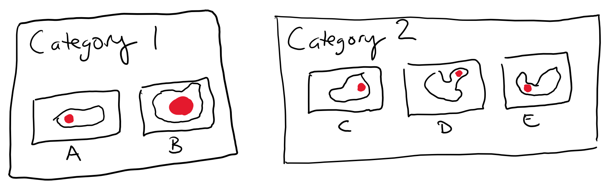
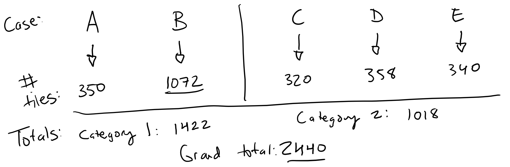

Appendix
========

.. _balancing:

A Note on Input Balancing
*************************

When training, it is important to consider whether class-level balancing should be performed on your input in order to reduce bias against sparse categories. There is no established best practice for input balancing when training on histology images; the balancing method you choose to use is up to you.

Let's walk through an example of the different balancing options available to you. Suppose you have five slides, labeled A through E. Slides A and B belong to category 1, while C, D, E belong to category 2. Let's suppose tumors in all the slides are roughly the same physical size, except for B which is three times as large.

You perform tile extraction, and all the cases except B produce roughly the same number of image tiles:

The training optimizer is ready for the next batch of images. Let’s say the batch size is 32. How does it select the next 32 images?

If **NO balancing** ("NO_BALANCE")is used, tiles will be selected randomly. Because slide B has so many more tiles than the other slides, B will be over-represented in the batch. The batch might look something like:

A A A A B B B B B B B B B B B B B B B C C C C D D D D D E E E E

This means that the model will inherently learn a bias towards case B. If cases like case B are truly of greater prevalence in the real-world population, this is fine; the model is learning an appropriate bias. Otherwise, it is learning a bias which will hurt the model’s generalizability, which will result in poor performance on our test set.

If **CASE-based balancing** ("BALANCE_BY_CASE") is used, the input stream will balance tiles in a given batch across the cases. Our batch would look something more like:

A A A A A A A B B B B B B C C C C C C D D D D D D E E E E E E E

Now the model has no bias towards any given case. However, you’ll notice that category 1 (cases A and B) only has 13 tiles, whereas category 2 (cases C, D, and E) has 19 tiles. With this type of balancing, models will learn bias towards categories with more cases (in this case category 2).

If **CATEGORY-based balancing** ("BALANCE_BY_CATEGORY") is used, the input stream balances tiles based on the category. Our batch would look like:

A A A A B B B B B B B B B B B B C C C C C D D D D D E E E E E E

There are now an equal number of tiles from category 1 and category 2, 16 from both. We are still unbalanced within category 1, as slide B has more tiles than slide A. However, because this unbalance is not occurring between categories, which is what the algorithm is training on, the bias effect is less prominent. The algorithm will expect category 1 to look more like slide B than slide A, but it is not clear whether this is avoidable. Unless you dispose of excess tiles, your model will be exposed to more tiles from B than from A, whether it happens on a per-batch basis or throughout its training across epochs. 
